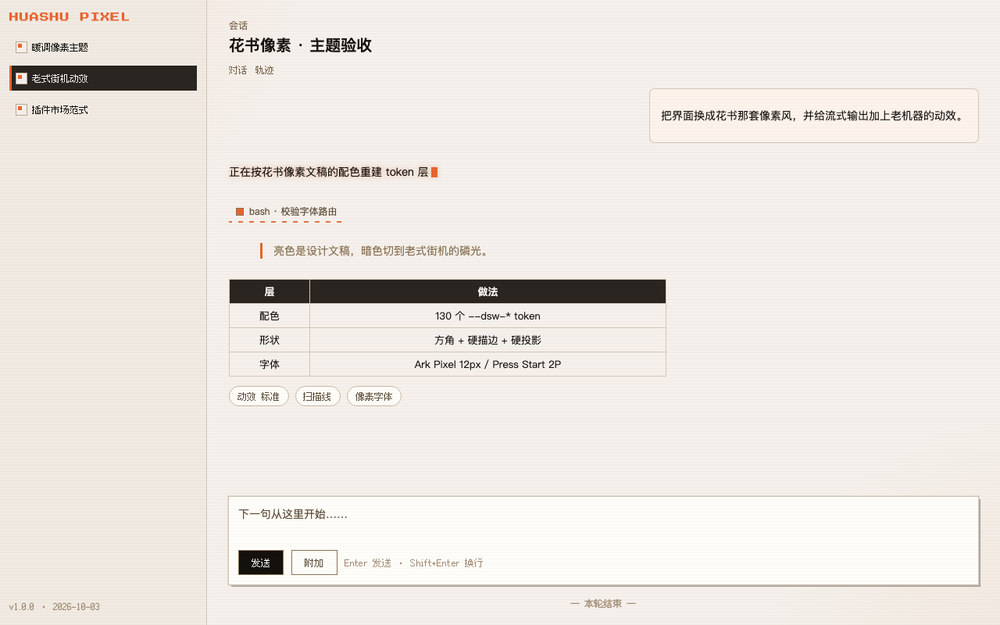
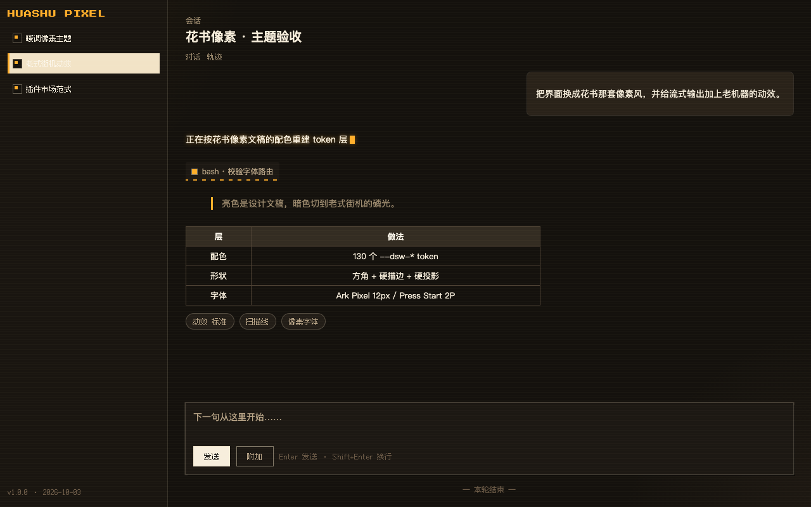
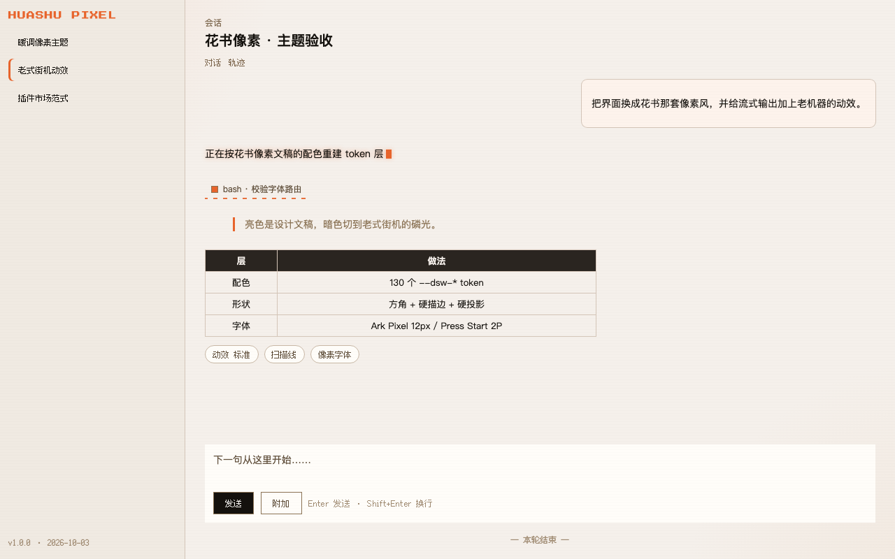
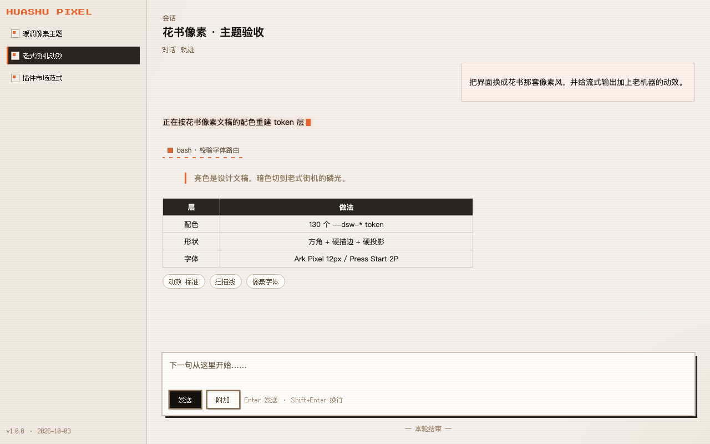
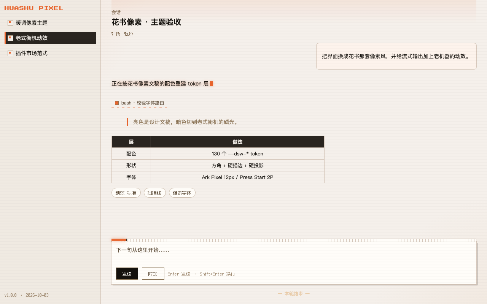
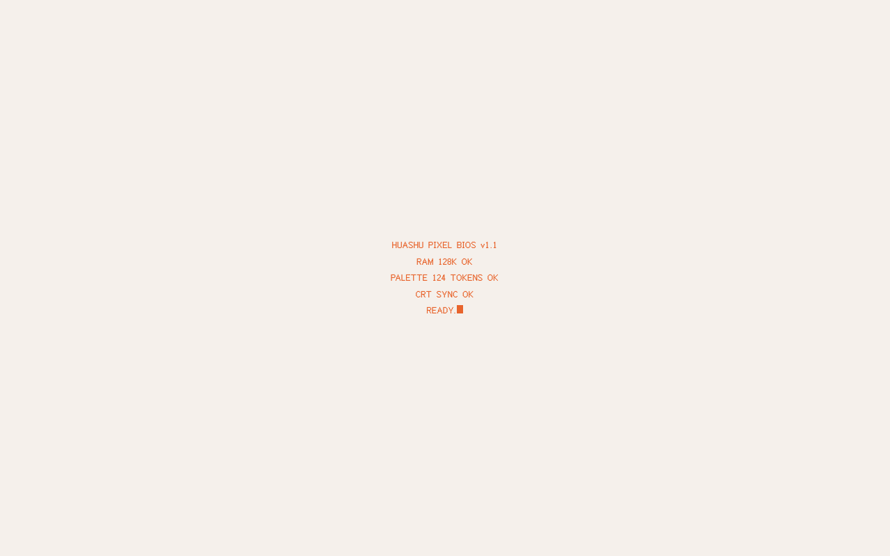

# dsh-huashu-pixel · 花书像素

给 DSH Web GUI 换一套**暖调像素**主题：亮色是暖米白纸面 + 深褐墨字的「设计文稿」，暗色切到老式街机的琥珀磷光；控件与标签用像素字体，正文保持系统字体；流式输出与状态变化带方块光标、扫描线、硬切闪帧等 CRT 动效。



 ·  ·  · 

> 截图由 `scripts/build-preview.mjs` 从**真 bundle** 生成（不是手抄的第二份 CSS）。

## 装

```sh
# 从 GitCode（主库，国内直连）
dsh plugin --profile desktop add https://gitcode.com/weixin_42127089/dsh-huashu-pixel

# 从 GitHub（镜像，投稿/市场链接走这里）
dsh plugin --profile desktop add github:jizenghui81/dsh-huashu-pixel

# 或从 npm
dsh plugin --profile desktop add dsh-huashu-pixel
```

> 简写只有 `github:` / `gitlab:` / `bitbucket:`，GitCode 要用**完整仓库地址**（安装器接受任意主机的 `https://主机/属主/仓库`）。

两种方式都要重启宿主/刷新页面后生效（改了浏览器半边时要 **Cmd+R 刷新**；宿主半边改动需要重启）。

## 配置

「设置 → 通用 → 花书像素」一行四组档位（存在浏览器 localStorage，刷新/重启后保留）：

| 档位 | 取值 | 默认 | 说明 |
|:--|:--|:--|:--|
| **强度** | 轻 / 标准 / 浓 | 标准 | 装饰的多寡：轻≈只换配色与字体；标准＝方角化 + 关键面硬描边 + 侧栏像素灯；浓＝控件全描边、卡片气泡也描边、菜单反白、圆角归零、扫描线更强 |
| 动效 | 标准 / 温和 / 街机 / 无 | 标准 | 街机档另加抖动、屏闪与完整 BIOS 自检；标准档只有一次约 0.6s 的上电 |
| 扫描线 | 开 / 关 | 开 | CRT 扫描线 + 暗角覆层（`pointer-events:none`，不影响点击） |
| 像素字体 | 控件与标签 / 全界面 / 全界面·12px / 关 | 控件与标签 | 全界面档连正文一起像素化；**全界面·12px** 把正文钉在像素字体的原生网格上最清晰 |
| 总开关 | 开 / 关 | 开 | 关掉即整套停用，资源全部回收 |

命令行里也能临时试档（与设置行同一份状态，会写入 localStorage）：

```js
__HUASHU_PIXEL__.set({ motion: 'arcade' })    // 街机档
__HUASHU_PIXEL__.set({ pixelFonts: 'all' })   // 全界面像素
__HUASHU_PIXEL__.reset()                      // 回到出厂默认
```

## 主题内容

- **配色**：覆盖 130 个 `--dsw-*` token。6 档静态色阶（换成暖色系）让所有 `var(--dsw-static-*)` 派生的别名自动跟随；别名层单独覆盖写死 hex 的 47 项（描边、遮罩、悬停、菜单实底、diff 底色、菜单分组底）。亮色对齐这套像素文稿的既有色：纸 `#F5F0EB`、卡 `#FFFDF9`、墨 `#2A2520`、棕 `#8B7355`、金 `#D4A574`、橙 `#E8642C`、描边 `#D4C5B8`；暗色为底 `#14110D`、面板 `#1C1813`、磷光米 `#F2E3C6`、琥珀 `#FFAE2B`。
- **形状**：圆角按强度三档（轻 2/4/6/8/10/12px · 标准 2/2/4/6/8/10px · 浓 0/0/0/2/4/6px）；侧栏会话行方块化、选中＝墨块 + 左侧橙灯 + 14px 像素灯位；菜单/浮层/对话框/输入区改**硬描边 + 3–5px 实心偏移投影**，去掉毛玻璃；滚动条 5px → 10px 且方角；表头墨底纸字；引用块 3px 橙线 + 棕字。
- **字体**：随包发布两个 OFL 像素字体——**Ark Pixel 12px**（中文 + 拉丁，552KB）与 **Press Start 2P**（拉丁展示体，12KB）。像素字体只在原生网格上清晰，所以控件统一钉在 12px；正文、代码与 markdown 标题保持系统字体。字体由 Host 半边经 `webServer` 路由 `/huashu-pixel/fonts/*` 直出（文件名白名单，不可穿越）。
- **输出中的 Loading 进度条**：只要会话里出现 `[data-shimmer]`（正在吐字）、`[data-running]`（步骤在跑）或 `[data-state="ongoing"]`（转轮在转），输入卡上沿就出现一条 7px 像素进度条——纸面底槽 + 8px 像素格，琥珀实心填充按 12 格走 18 秒推进到 92%，右缘一块更亮的"打印头"；跑完整条走满、闪一下再淡出。判定在会话滚动容器内做 140ms 尾随节流，不逐次跑全量查询。
- **侧栏文字**：会话/项目标题**不套像素字体**（12px 网格在标题上偏小、看不清），改用系统字体并放到 14px；像素感由像素灯位、方块行与选中墨块承担。
- **动效**：开屏有一次 CRT 上电自检（标准档两行约 0.6s，街机档五行 BIOS 约 1.25s，点一下可跳过）；流式文字尾部方块光标硬闪 + 磷光，浓档另有一条逐格行进的橙色"打印头"下划线，官方扫光只改缓动为 `steps(8)`，运行中转轮改 4 格跳转；`[data-running]` 步骤底部一条逐格行进的像素条；一轮开始扫描线下扫一次；一轮结束 CRT 收尾闪（只动 `filter`）；出错红灯硬闪两下；菜单硬弹出；`prefers-reduced-motion` 下全部关闭。

## 为什么升级不容易打崩

- **配色走官方扩展点**：`ctx.theme.overrideTokens(id, tokens)`，内联生效、优先于任何样式表，亮暗两套随主题自动取值；同一份 token 表同时生成样式表兜底。
- **动效只认组件已经写在 DOM 上的稳定属性**：`data-shimmer` / `data-running` / `data-turn-start` / `data-turn-end` / `data-state` / `data-error` / `data-menu-material` / `data-composer-card` 等；不改任何组件、不读别人的 CSS Module 类名（需要按类名兜底时才用 `[class*="_名字"]` 这种稳定后缀）。
- **Host 半边无依赖**：只用 Node 内置模块 + `webServer` 注册一条字体路由；没有 Config、没有 `node_modules`、没有构建步骤（`lib/` 就是产物）。
- **配置存 localStorage**：第三方插件的 dsh-settings 命名空间在 Web 客户端读不到（Host apiproxy 只暴露白名单内的命名空间），所以开关与档位自持在浏览器里——自包含、不需要改宿主。

## 自检

```sh
npm run check     # 双文件语法 + 冒烟测试
npm test          # 最小 DOM/React/cordis 替身跑真 bundle：注入 / token 契约 / 强度三档 / 槽位注册 / 卸载 / 兜底
npm run verify:drag   # 真 Chromium 跑 macOS 拖拽区探针（需本机 Chrome；改样式表/加 body 级元素后必跑）
node scripts/build-preview.mjs   # 从真 bundle 重新生成 preview.html 与 preview-dark.html
```

> ⚠️ **加 body 级全屏元素前先读这条**：官方 ui-web 给 `body>:not(#root)` 钉了
> `-webkit-app-region:no-drag`，而 Blink 按文档顺序"并/减"拖拽区——挂在 `#root` 之后的
> 全屏覆层会把整个窗口的拖拽区减没，表现是**窗口拖不动**（点击正常）。
> 本主题的 CRT 覆层与开屏自检靠 `-webkit-app-region:initial !important` 复位
> （**不能写 `none`**，本代 Chromium 把显式 `none` 算成 `no-drag`）。细节见 CHANGELOG V1.2.1。

装到 profile 后的验收证据：

```sh
curl -sI http://127.0.0.1:19387/huashu-pixel/fonts/huashu-pixel-cjk-12.woff2   # 200 + font/woff2
# cordis_inspect_query(client, Slots, listSubTree, root=settings.general.item) → 占用行 id: huashu-pixel
# cordis_inspect_query(client, Theme, listTokens) → 124 个 token 由本插件注册（圆角改由样式表按强度三档声明）
```

## 发布

见 [docs/PUBLISHING.md](docs/PUBLISHING.md)：npm 发布与 awesome-dsh-plugin 投稿（分类 `theme`）的具体步骤，投稿文件模板在 [docs/awesome-dsh-plugin.yml](docs/awesome-dsh-plugin.yml)。

## 授权

代码 MIT（见 [LICENSE](LICENSE)）。字体沿用各自授权，均为 **SIL Open Font License 1.1**，可随包分发：
`fonts/LICENSE-ArkPixel-OFL.txt`（Ark Pixel Font · TakWolf）与 `fonts/LICENSE-PressStart2P-OFL.txt`（Press Start 2P · The Press Start 2P Project Authors）。
